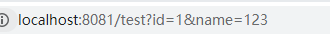

# Vue-Router路由跳转的三种方式

### 1.直接push

router

```js
{
    path: "/test/:id",
    name:'test',
    component: () => import('views/test/Test.vue')
  }
```

push

```js
this.$router.push('/test/' + path);
```

取出参数

```js
this.path = this.$route.params.id;
```

路径


### 2.使用params传递

router

```js
{
    path: "/test",
    name:'test',
    component: () => import('views/test/Test.vue')
  }
```

push

```js
  this.$router.push({ name: 'test', params: { id: path }})
```

取值

```js
  this.path = this.$route.params.id;
```

路径

AR9~X~OIYX89.png)

### 3.使用query

router

```js
{
    path: "/test",
    name:'test',
    component: () => import('views/test/Test.vue')
  }
```

push

```js
 this.$router.push({  path: '/test', query: { id: path ,name:'123'}})
```

取值

```js
 this.path = this.$route.query.id
```

路径

