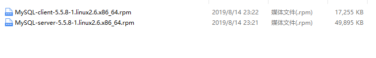

RPM安装

### 下载对应得RPM

**链接:<https://downloads.mysql.com/archives/community/**>

选择对应得版本



### 准备安装

#### 安装服务端

**命令**

```shell
rpm -ivh MySQL-server-5.5.8-1.linux2.6.x86_64.rpm
```

**出现安装异常rpm冲突**

```properties
file /usr/share/mysql/russian/errmsg.sys from install of MySQL-server-5.5.8-1.linux2.6.x86_64 conflicts with file from package mariadb-libs-1:5.5.60-1.el7_5.x86_64
	file /usr/share/mysql/serbian/errmsg.sys from install of MySQL-server-5.5.8-1.linux2.6.x86_64 conflicts with file from package mariadb-libs-1:5.5.60-1.el7_5.x86_64
	file /usr/share/mysql/slovak/errmsg.sys from install of MySQL-server-5.5.8-1.linux2.6.x86_64 conflicts with file from package mariadb-libs-1:5.5.60-1.el7_5.x86_64
```

**移除对应得rpm**

```shell
yum -y remove mariadb-libs-1:5.5.60-1.el7_5*
```

**重新安装**

```shell
rpm -ivh MySQL-server-5.5.8-1.linux2.6.x86_64.rpm
```

**日志信息**


#### 安装客户端

```shell
 rpm -ivh MySQL-client-5.5.8-1.linux2.6.x86_64.rpm 
```

#### 安装失败

**如果安装失败显示*"GPG keys ..."***

```shell
rpm -ivh MySQL-server-5.5.8-1.linux2.6.x86_64.rpm --force --nodoeps
```

**检验是否安装完成**

```shell
mysqladmin  --version
```

显示对应得版本则安装成功!

### 基本命令

**启动:**

```shell
service mysql start
```

**停止**

```shell
service mysql stop
```

重启

```shell
service mysql restart
```

**设置开机自启/关闭**

```shell
1.每次使用前手动启动服务etc/init.d/mysql start
chkconfig mysql on
chkconfig mysql off #关闭
ntsysv   #查看是否自启
```

### 相关配置

#### **日志信息**

```shell
/usr/bin/mysqladmin -u root password 'new-password'
/usr/bin/mysqladmin -u root -h VM_0_14_centos password 'new-password'
```

#### **设置密码**

```shell
/usr/bin/mysqladmin -u root password 123456
```

#### **查看数据库存放目录**

```shell
ps -ef|grep mysql
```

显示:

```properties
/bin/sh /usr/bin/mysqld_safe --datadir=/var/lib/mysql --pid-file=/var/lib/mysql/VM_0_14_centos.pid TERM=xterm SYSTEMCTL_SKIP_REDIRECT= PATH=/sbin:/usr/sbin:/bin:/usr/bin:/usr/bin PWD=/usr SHLVL=2 SYSTEMCTL_IGNORE_DEPENDENCIES= OLDPWD=/ _=/usr/bin/mysqld_safe
```

#### 文件目录

**数据存放目录:datadir=/var/lib/mysql*** 

***pid文件目录:pid-file=/var/lib/mysql/VM_0_14_centos.pid***

**mysql核心目录**

```properties
/var/lib/mysql :mysq1_ 安装目录
/usr/share/mysql:配置文件
/usr/bin :命令目录(mysqladmin , mysqldump等命令)
etc/init.d/mysql :mysql启停脚本
```

#### MySQL配置文件

|     文件名     |        作用        |
| :------------: | :----------------: |
|  my-huge. cnf  | 高端服务器1-2G内存 |
| my-large. cnf  |      中等规模      |
| my-medium. cnf |        一般        |
| my-small. cnf  |        较小        |

**但是，以上配置文件mysq1默认不能识别，默认只能识别/etc/my. cnf**   

采用my-hulge. cnf

```shell
 cp my-huge.cnf /etc/my.cnf
```

***注意: mysq15. 5默认配置文件/etc/my. cnf; Mysql5. 6默认配置文件/etc/ mysql-default. cnf***

#### 查看mysql编码

```shell
 show variables like '%char%';
```

#### 设置编码

在/etc/my.cnf修改

```properties
[mysql]
default-character-set=utf8
[client]
default-character-set=utf8
[mysqld]
character_set_server=utf8
character_set_client=utf8
collation_server=utf8_general_ci
```

重启MySQL

```shell
service mysql restart
```

**配置远程连接**

```sql
grant all privileges on *.* to 'root'@'%' identified by '123456' with grant option;
flush privileges;
```

**完成!**