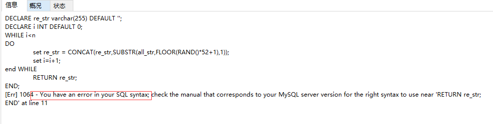
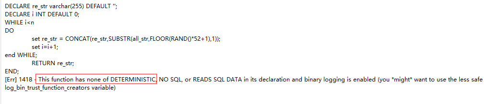

# mysql创建函数

## 建表SQL

```sql
--dept
CREATE TABLE dept (
`dno`  int(5) NOT NULL ,
`dname`  varchar(20) CHARACTER SET utf8 COLLATE utf8_general_ci NOT NULL ,
`loc`  varchar(30) CHARACTER SET utf8 COLLATE utf8_general_ci NULL DEFAULT NULL ,
PRIMARY KEY (`dno`)
)
ENGINE=InnoDB
DEFAULT CHARACTER SET=utf8 COLLATE=utf8_general_ci
ROW_FORMAT=COMPACT;
--emp
CREATE TABLE emp (
`eid`  int(5) NOT NULL ,
`ename`  varchar(20) CHARACTER SET utf8 COLLATE utf8_general_ci NOT NULL ,
`job`  varchar(20) CHARACTER SET utf8 COLLATE utf8_general_ci NOT NULL ,
`deptno`  int(5) NULL DEFAULT 0 ,
PRIMARY KEY (`eid`)
)
ENGINE=InnoDB
DEFAULT CHARACTER SET=utf8 COLLATE=utf8_general_ci
ROW_FORMAT=COMPACT;
```


## 函数

### 创建函数

```sql
create function randstring(n int) returns varchar (255)
BEGIN
DECLARE all_str varchar(100)  DEFAULT 'qwertyuiopasdfghjklzxcvbnmQWERTYUIOPLKJHGFDSAZXCVBNM';
DECLARE re_str varchar(255) DEFAULT '';
DECLARE i INT DEFAULT 0; 
WHILE i<n
DO
	set re_str = CONCAT(re_str,SUBSTR(all_str,FLOOR(RAND()*52+1),1));
	set i=i+1;
end WHILE;
	RETURN re_str;
END;
```

#### SQL解析错误



**说明sql语句存在问题,sql解析错误!**



**是因为存储过程/存储函数在创建时与慢查询日志冲突了**

##### 查看

```sql
show variables like '%log_bin_trust_function_creatos%';
```

##### 解决冲突

**临时解决**

```sql
set global log_bin_trust_function_creatos=1;
--或者
set global log_bin_trust_function_creators=TRUE;
```

**永久解决**

*在/etc/my.cnf添加*

```sql
[mysq1d]
log_bin_trust_function_creatos= 1
```

### 产生随机整数

```sql
--产生随机整数
create function ran_num () returns int (5)
begin
declare i int default 0;
set i =floor(rand()*100);
return i; 
end;
```

## 存储过程

### 创建存储过程

```sql
create procedure insert_emp( in eid_start int(10), in data_times int(10))
begin
declare i int default 0;
set autocommit = 0 ; 
repeat
insert into emp values(eid_start + i,randstring(5) ,'other',ran_num());
set i=i+1 ;
until i = data_times 
end repeat;
commit ;
end;
```

```sql
create procedure insert_dept( in dno_start int(10), in data_times int(10))
begin
declare i int default 0;
set autocommit = 0 ; 
repeat
insert into dept values(dno_start + i,randstring(6) ,randstring(8));
set i=i+1 ;
until i = data_times 
end repeat;
commit ;
end;
```

### 调用存储过程

```sql
--从1000开始插入800000条数据
CALL insert_emp(1000,800000);
--从10开始插入30条数据
CALL insert_dept(10,30);
```

# 分析海量数据

## profiles

```sql
show profiles ; --默认关闭
show variables like '%profiling%';
--开启
set profiling= on ;
--show profiles : 会记录所有profiling打开之后的全 部SQL查询语句所花费的时间。缺点:不够精确
```

## 精确分析:sql诊断

```sql
show profile all for query 上一步查询的的Query_Id
--显示cpu和io的消耗
show profile cpu, block io for query 上一步查询的的Query_Id
```

## 全局查询日志

***PS:记录开启之后的全部SQL语句。(这次全局的记录操作 仅仅在调优、开发过程中打开)***

**开启后，会记录所有SQL**