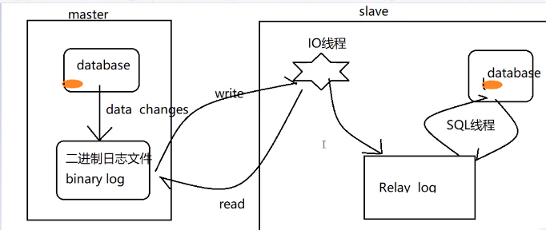
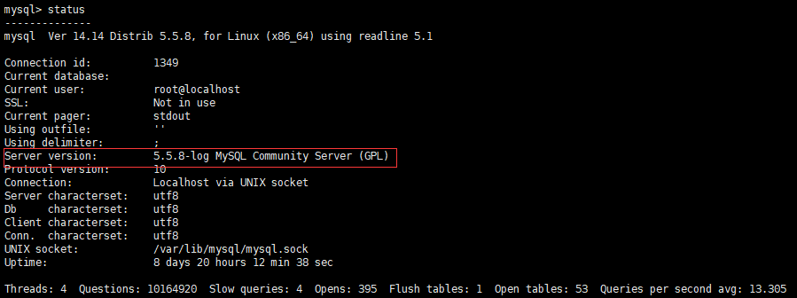
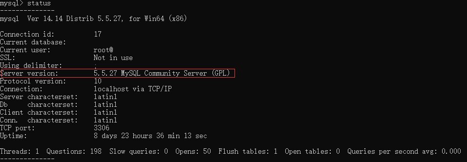

# MYSQL主从复制

## 流程



1. **master将改变的数记录在本地的二进制日志中(binary log) ;该过程称之为二进制日志事件.***
2. **slave将master的binary log拷贝到自己的relay log (中继日志文件)中.**
3. **中继日志事件，将数据读取到自己的数据库之中**

***PS:MYSQL主从复制是异步的，串行化的，有延迟.***

## 配置

### 两个数据库

#### 版本

**从Linux:**



**主windows:**



***PS:版本不要相差太大***

### 配置文件

**windows(MySQL :my.ini)**

**Linux(MySQL :my.cnf)**

**关闭防火墙**

linux:

```shell
#配置前，为了无误，先将权限、防火墙等处理:
#关闭windows/linux防火墙:
#windows:右键“网络”,
#linux:
service iptables stop
#或者
systemctl stop iptables.service
```

#### 配置my.ini

### 主机

```properties
[mysqld]

#id
server-id=1
#二进制记录文件
log-bin="C:/Program Files/MySQL/MySQL Server 5.5/data/mysql-bin"
#错误记录
log-bin="C:/Program Files/MySQL/MySQL Server 5.5/data/mysql-error"
#主从复制忽略的库
binlog-ignore-db=mysql
#(可选)指定主从同步时，同步哪些数据库
binlog-do-db=test
```

#### 授权

**windows中的数据库授权哪台计算机中的数据库是自己的从数据库:** 

授权192.168.2下所有的计算机 并且用户名是root密码也是root

```sql
GRANT REPLICATION slave, reload, super ON *.* TO 'root' @'192.168.2.%' IDENTIFIED BY 'root';
flush privileges;

GRANT REPLICATION slave, reload, super ON *.* TO 'root' @'94.191.23.136' IDENTIFIED BY '123456';
flush privileges;

#本地授权
update mysql.user set authentication_string=password('123456')where user='root';
flush privileges;

flush privileges;
grant all privileges on *.* to root@'localhost' identified by "123456";
flush privileges;

#远程连接   ------只需要此操作
flush privileges;
grant all privileges on *.* to 'root'@'%' identified by '123456' with grant option;
flush privileges;
```

查看MySQL二进制文件名 以及磁盘的位置

show master status


### 从机

my.cnf

```properties
[mysqld]
server-id=2
log-bin=mysql-bin
#和主机中的对应
replicate-do-db=test
```

#### 授权

```sql
CHANGE MASTER TO
MASTER_HOST='http://winmysql.free.idcfengye.com’,
MASTER_USER ='root',
MASTER_PASSWORD ='123456',
MASTER_ PORT = 3306,
master_log_file='mysql-bin.000001',
master_log_pos=107;


--开启主从同步
start slave
--检查状态  主要观察  Slave_ I0_ Running和S1ave_ SQL_ Running， 确保二者都是yes;
show slave status \G;

--查看service-id
show variables like' %server_id%';

stop slave
--系统全局设置
set global server_id=2;
start slave
show slave status \G;
```

