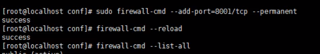

# 1.nginx

## 一.操作

查看开放端口,并开放端口



```shell
#开放端口
sudo firewall-cmd --add port-8001/tcp --pemanent   
#重启防火墙
firewall-cmd -- reload
#查看开放的端口
firewall-cnd --list all
```


## 二.配置


### 第一部分全局块

**从配置文件开始到events 块之间的内容,主要会设置一些影响nginx服务器整体运行的配置指令。**
**比如worker processes 1;**
**worker processes值越大,可以支持的并发处理量也越多。**

### 第二部分events块

**events块涉及的指令主要影响Nginx服务器与用户的网络连接**
**比如worker connections 1024; 支持的最大连接数**

### 第三部分http块

**Nginx服务器配置中最频繁的部分**
**http块也可以包括http全局块、server 块**

```shell
#查看catalina.out 文件信息
tail -f catalina.out 
```

反向代理

```properties
server {
		listen 80; 
		server_ name 192. 168.17.129;
		#charset koi8-r;
		#access_ Log logs/host.access.log main;
		
		location / {
			root html ;
			proxy_ pass http://127.0.0.1:8080;
			index index.html index.html; 
}
```

根据请求中参数名代理到不同得服务器

```properties
server{
	listen 9001;
	server name 192.168.17.129;
	
	location ~ /edu/ {
	proxy_ pass
		http://127.0.0. l: 8080;
	}
	
	Location ~ /vod/ {
		proxy_ pass http://127.0. 0.1:8081;
	}
}
```

**PS**

```tex
1、=:用于不含正则表达式的uri前，要求请求字符串与uri 严格匹配，如果匹配
成功，就停止继续向下搜索并立即处理该请求。。
2、~:用于表示uri包含正则表达式，并且区分大小写。。
3、^ *:用于表示uri包含正则表达式，并且不区分大小写。。
4、^~:用于不含正则表达式的
uri前，要求Nginx服务器找到标识uri和请求字
符串匹配度最高的location 后，立即使用此location处理请求，而不再使用location
块中的正则uri和请求字符串做匹配。。
```

keepalived
 